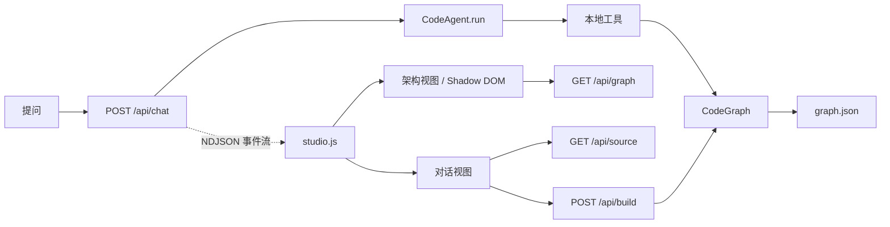

# CodeAtlas Studio 设计说明

## 目标

Homework 1 要求一个能工作的代码助手：接收任务、调用工具并返回结果。本实现把当前 checkout 解析成文件、符号和调用关系，让单 Agent 在受限的工具邻域内选择构图、查询、读文件、写文件或执行代码，完成一次代码库审查，并把关系图、源码证据和工具轨迹放在同一个可检查的界面里。

设计上只做两件事：**每个结论都能追到真实源码位置**，以及**每层边界都在服务端强制**。

## 架构



`code_agent.py` 负责模型循环、工具契约、会话表、HTTP 服务和事件流；`code_graph.py` 负责增量解析、关系解析和缓存；`languages.py` 提供语言提取规则；`studio.html/css/js` 是外壳（会话列表、对话、composer、主题、视图切换）；`atlas_view.html`、`atlas_view.js`、`atlas.css` 是图谱视图；`atlas_graph.js` 是纯布局与模型库，不接触 DOM。服务从模块文件位置解析所有静态资源，因此不依赖启动时的工作目录。

## 为什么图谱跑在 Shadow DOM 里

图谱原本是一份整页文档：721 行样式里有 `:root`、`* { margin:0; padding:0 }`、`html, body { … }` 和 `body { user-select:none }`，脚本用 `document.getElementById` 和全局 `document.querySelectorAll` 取元素。

把它和对话界面放进同一个文档有两种做法：给 600 多条选择器逐个加前缀，或者把它挂进 shadow root。选后者。Shadow DOM 让全局重置、`html/body` 选择器、z-index 层级和 SVG marker 的 `url(#id)` 片段引用全部自动作用域化，因此 `atlas.css` 只需要 6 处改写：

| 原选择器 | 改为 | 原因 |
| --- | --- | --- |
| `:root` | `:host` | 自定义属性需要挂在宿主元素上，才能继承进 shadow |
| `html, body { … }` | 并入 `:host { … }` | shadow 内没有 `html`/`body` |
| `body { font-family; user-select:none }` | 并入 `:host { … }` | 同上；`user-select:none` 必须留在 shadow 内，否则对话文本无法选中 |
| `.app { width:100vw; height:100vh }` | `width:100%; height:100%` | 图谱现在是窗格，不是视口 |
| `.scene-transition #graph-svg` | `.is-transitioning #graph-svg` | 过渡类从 `<body>` 移到宿主元素 |
| `* { … }` | 不变 | 已天然作用域化 |

脚本侧只有一处结构性改动：`$` 从 `document.getElementById` 变成 shadow 作用域查询，8 处 `document.querySelectorAll` 改为 shadow 查询。`window.innerHeight` 的读取改为传入的画布高度——视口高度在窗格里已经不是正确的尺子。窗口 `resize` 监听保留，但增加了「宿主尺寸为 0 时直接返回」的保护：图谱隐藏时量到 0×0，此时渲染会画出空白。

外壳切回架构视图时先翻 `data-view`，再在 `requestAnimationFrame` 里调 `AtlasView.show()`。同步调用会在浏览器完成布局之前渲染。

图谱过渡类挂在宿主元素上，遮蔽规则是 `.is-transitioning #graph-svg`，写在 shadow 样式表内，因此不会影响外壳。

## 图谱生命周期

1. 服务启动时对当前仓库运行一次 `CodeGraph.build()`。
2. `GET /api/graph` 返回当前内存图谱；架构视图挂载后自己拉取它。
3. `POST /api/build` 才切换分析目标或刷新图谱；成功后替换当前图谱并清空会话表（旧会话的 agent 仍持有上一张图），失败时保留错误并返回 HTTP 400。
4. 缓存 revision 只由 `code_graph.py` 与 `languages.py` 的字节决定。视图文件改了不影响图谱数据，因此改样式不会让整张图的缓存失效。

## 对话与流式

`POST /api/chat` 直接用 `application/x-ndjson` 返回事件流：一行一个 JSON 对象。相比 SSE，省掉了 `event:`/`data:` 多行拼接、注释心跳和 `\n\n` 分帧规则，本地回环也不需要保活。

四种事件：

```
{"t":"tool",  "id":"call_1", "phase":"Agent step 1", "tool":"query_graph", "state":"running", "detail":"…"}
{"t":"answer","text":"…"}
{"t":"done",  "mode":"llm", "steps":3, "tokens":412}
{"t":"error", "error":"…"}
```

`CodeAgent.run(prompt, on_event=None)` 内部用 `_emit()` 同时写入 `self.events` 并转发给回调。回调默认 `None`，所以 CLI 路径和既有测试不受影响。

工具事件分两次发出（`running` 再 `done`/`failed`），共享同一个 `id`，前端按 `id` 原地替换那一行。回答不逐 token 流式：模型调用保持非流式，答案一次性给出。真正做 token 流式要按 `delta.tool_calls[i].index` 拼接碎片化的参数、在 `finish_reason` 时才重组消息，那是「arguments is not valid JSON」的经典来源，收益远小于风险。

没有模型 key 时端点不报错，而是把 `local_review()` 的结果按同一套事件格式流出去，并在 `done` 里标 `mode:"local"`。离线结论同样引用真实 `file:line`：取关系度数最高的符号、解析不完整的文件和测试文件，前端把它们渲染成可点开的证据链接。

## 并发模型

HTTP 服务是 `ThreadingHTTPServer`，`daemon_threads = True`。这不是可选项：一次对话要把一个连接占满整轮 agent 运行，同时浏览器还要并发拉 `/api/graph`、`/api/source` 和静态资源。单线程下这些请求会一直堵在 accept 队列里，界面看起来就是卡死。

由此带来的共享状态：

- `state`（当前仓库、图谱构建器、图谱、错误）由一个 `threading.Lock` 保护，读侧取快照后再用。
- 会话表 `SESSIONS` 由 `SESSIONS_LOCK` 保护；**每个会话另有一把锁**，因为 `CodeAgent.messages` 是可变的，同一会话并发两次会在对话历史里交错。
- 会话上限 4 个，插入时按最近使用时间淘汰最旧的。所有会话共享同一个 `CodeGraph` 实例——真正占内存的不是消息列表，而是每个 agent 各自构建的图（几千个节点和边）。
- 全局并发信号量上限 4，避免线程数失控。
- 客户端中途断开时 `wfile.write` 抛 `BrokenPipeError`，端点吞掉它并结束；正在进行的模型调用无法中断，但循环会在下一步停止。

## 工具边界

| 工具 | 输入 | 约束 |
| --- | --- | --- |
| `build_graph` | 仓库根目录 | 忽略 `.git`、构建产物、虚拟环境和敏感文件 |
| `query_graph` | 查询词、数量上限 | 最多返回 30 个匹配和 120 条关系，并报告是否截断 |
| `read_file` | 相对路径、起止行 | 单次最多 200 行，路径必须在仓库内 |
| `write_file` | 相对路径、完整文本 | 禁止越界和凭证文件 |
| `run_python` | 文件名或短代码 | 独立子进程，30 秒超时并截断输出 |

`GET /api/source` 只接受图谱中登记过的文件名，返回从指定行开始的最多 120 行。路径会 `resolve()` 后再次检查仓库边界；`.env`、`auth.json`、`credentials.json`、`*.pem`/`*.key`/`*.p12`/`*.pfx` 和指向仓库外的符号链接都拒绝读取。这些拒绝路径有测试覆盖。

## 关系与交互

节点代表真实文件或符号，边保留 `imports`、`calls`、`contains` 等解析得到的语义及调用位置。未能唯一解析的动态调用会被省略并计入统计，界面顶部和侧栏都显示这些数字，不静默丢弃。

悬停节点只突出直接相邻关系，点击模块进入该模块的局部邻域，`Esc` 返回全景（返回布尔值，外壳据此决定是否继续处理 Esc）。连线、箭头、节点卡片和横切 feature 都由 SVG/CSS 绘制，页面没有远程图片、CDN 或网络字体依赖。

三个视图各自回答一个问题：主图区回答「模块怎么连」，底部横切项回答「一个关注点经过哪些文件」，对话界面回答「为什么得出这个结论、证据在哪一行」。

## 课程要求对应关系

| 要求 | 实现 |
| --- | --- |
| 输入 → 推理 → 工具 → 输出 | `CodeAgent.run()` 消息循环 |
| 至少一种工具 | 构图、关系查询、读文件、写文件、执行代码 |
| 记忆与上下文 | 会话表 + `messages` 列表 + 图谱邻域查询 |
| 错误处理与重试 | 工具错误作为观察回流，步数和超时双重停止，无 key 时降级为本地审查 |
| 可维护性 | Agent、图谱、语言规则、外壳和视图分层，无构建步骤、无框架 |
| 代码库审查 | `/api/chat` 流式返回结论、工具轨迹和可点开的源码证据 |

## 验证

```powershell
python -m pytest tests -q
python -m py_compile code_agent.py code_graph.py languages.py
python code_agent.py . --port 8768
```

测试不需要模型 key，也不需要网络。图谱的正确性用「同一份图谱在重构前后渲染出的节点数、连线数、SVG 路径数、统计文本、inspector 指标完全一致」来保证。

## 已知边界

静态解析无法覆盖所有动态调用，未能唯一解析的关系会被省略并计入 `stats`；图谱是静态近似，不是运行时事实。`run_python` 是超时受限的本地子进程，不等同于操作系统级沙箱；处理不可信仓库时仍应使用专用隔离环境。离线审查不做语义理解，只从图结构推导结论。
