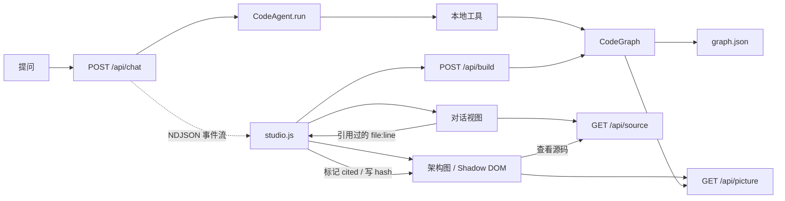

# CodeAtlas Studio 设计说明

## 目标

Homework 1 要求一个能工作的代码助手：接收任务、调用工具并返回结果。本实现把当前 checkout 解析成文件、符号和调用关系，让单 Agent 在受限的工具邻域内选择构图、查询、读文件、写文件或执行代码，完成一次代码库审查，并把可下钻的关系图、源码证据和工具轨迹放在同一个可检查的界面里。

设计上只做两件事：**每个结论都能追到真实源码位置**，以及**每层边界都在服务端强制**。

## 架构



`code_agent.py` 负责模型循环、工具契约、会话表、HTTP 服务和事件流；`code_graph.py` 负责增量解析、关系解析和缓存；`languages.py` 提供语言提取规则；`picture.py` 是 CodeGraph 与架构图 viewer 之间唯一的适配层；`studio.*` 是外壳；`circular_view.html` 是圆形图；`vendor/limen/` 是第三方架构图 viewer。服务从模块文件位置解析所有静态资源，因此不依赖启动时的工作目录。

## 架构图：shadow root 嵌入

架构图不是外壳写的，是上游代码，集成方式由它的内部结构决定。

上游 viewer 原本独占整个文档：样式表里有 `:root`、`*`、`html, body`，脚本用 `document.getElementById` 和 `document.activeElement` 取元素。要让它和对话界面共存，可以把它的选择器逐个加前缀，也可以把它挂进 shadow root。

选后者，因为 shadow DOM 让全局重置、`html/body` 选择器、z-index 层级和 SVG 片段引用全部自动作用域化。代价被压到 8 处改动：CSS 3 处（`:root` → `:host` 两处，`html, body` 与 `body` 合并进一条 `:host`），JS 5 处（`root` 变量 + `$()` 经由它查询、`activeElement` 8 处改为 `root.activeElement`、`document.title` 加独立运行守卫、`onKey` 加可见性守卫、结尾 `init()` 换成 `mount()`）。

还有一条容易被忽略的级联规则：**外层文档的规则压过 shadow 内部的 `:host` 规则**。所以外壳绝不能给 `#picture-host` 设 `display` —— 一旦设了，viewer 的 `:host { display: grid }` 就被顶掉，Stage 失去高度约束，viewport 会撑到几千像素。外壳只负责给宿主一个确定尺寸的父元素，其余全交给 `:host`。

同理，主题也走这条规则：viewer 原本靠 `prefers-color-scheme`，看不到外壳的手动开关。外壳在 `#picture-host` 上重新声明那套 token 就能覆盖它，不需要改动 vendored 文件。

`onKey` 守卫是必需的，不是保险：上游的 `/`、`Escape`、`Backspace` 是无条件处理的，不守卫就会在用户于对话视图打字时抢占键盘。守卫用 `host.offsetParent` 判断宿主是否可见。

`init()` 在 `refresh()` 时会再跑一遍，所以文档级监听和 `ResizeObserver` 必须幂等：keydown 重复注册会让一次 `Esc` 下钻两级。

### 适配窗格：高度也要参与缩放

上游的布局只按宽度缩放，因为它原本独占一个窗口，高度不是约束。塞进窗格后高度成了稀缺的那一维，于是把高度也纳入缩放，整层一屏可读；低于下限就滚动，这比把字缩到看不清更诚实。下限取 0.65。

第一版把侧栏用 `display: none` 藏掉，结果 viewport 宽度变成 0：`.main` 是三轨 grid，grid item 被移出文档流后，后面的 item 会各往前挪一条轨道，`.stage` 落进了那条 0 宽的轨道。改成显式重定义两轨；viewer 自带的 `explorer-closed` 规则同样不可用，因为它把 explorer 设成 `display:none` 却仍保留 0 宽的第一轨。

`#viewport` 还加了 `scrollbar-gutter: stable`：高度溢出会触发滚动条，滚动条会吃掉宽度，宽度变化又会触发重新布局并算出新的适配，两边来回抖。

### 中文界面

上游的 kind / relation / status 名字同时是**数据**和**显示文本**：它们要穿过 `M.relClass` / `M.kindClass` / `M.statusClass` 这些查表来决定配色。所以不能在适配器层把名字改成中文——那会连带丢掉语义色。

做法是分开：模型里保留原名，viewer 里加一层 `REL_LABELS` / `KIND_LABELS` / `STATUS_LABELS` / `OVERLAY_LABELS` / `LEVEL_LABELS`，只在渲染文本时查。`plural()` 也一样，中文没有复数，量词直接写进单位里。少数由适配器自己生成的文本（元数据行的标签、节点摘要里的类型名）在 `picture.py` 里翻译，因为它们不经过 viewer 的查表。

### 数据流

`picture.py` 生成一个惰性 `<template>`，外壳把它克隆进 shadow root；`/api/picture` 返回同样的内容但去掉外层包裹，供重新构图后就地刷新 —— 这样不必重载页面，会话和滚动位置都保留。片段里还带一份「文件 → 图上的位置 id」索引，让外壳不必知道 viewer 用什么 id 寻址。

## 结论与结构互相可达

这是两个视图并存而不是各说各话的理由。对话回答「为什么这么说」，架构图回答「代码在哪」，两者之间必须能一步走通，否则它们只是两个功能。

**对话 → 图。** 每轮回答渲染后，外壳扫描其中的 `file:line` 链接，按文件收集「哪几行提到了它」。被引用的文件在图上对应的块加 `cited` 类，显示蓝色描边和「结论涉及」。这个集合是**从已渲染的对话重建**的，不是累加的，所以会话切换或重新渲染之后它依然正确。块的 DOM 在每次换层时重建，所以标记靠 `MutationObserver` 监听 `#blocks` 重打；加类不是 childList 变化，不会自激。

**图 → 对话。** 适配器写进详情面板的「查看源码」按钮，外壳用事件委托接住（按钮在 shadow 里，靠 `composedPath` 找），打开同一个弹窗。弹窗除了源码片段，还列出本次对话里提到这个位置的原话，以及一个「在架构图中查看」按钮——它查位置索引拿到 id，写进 URL hash，viewer 自己的 `onHash` 就完成跳转。

**外壳不改 viewer 的渲染逻辑**：标记是外壳给块加类，跳转是驱动 viewer 已有的 hash 导航。vendored 代码里没有一行为了这个功能而存在。

### 为什么删掉圆形图

它回答的是「代码量的分布长什么样」。但节点只有零星几个有标签，看不出是什么；不能下钻，点不进源码；和任何结论都不发生关系。它是一个图片，不是一个工具。要让它回答「风险集中在哪」，得按无测试覆盖、静态无法定位的调用占比重新定义节点，那是另一个功能，不是修 bug。

## 图谱生命周期

1. 服务启动时对当前仓库运行一次 `CodeGraph.build()`。
2. `GET /api/graph` 返回当前内存图谱。
3. `POST /api/build` 切换分析目标或刷新图谱；成功后替换当前图谱并清空会话表（旧会话的 agent 仍持有上一张图），失败时保留错误并返回 HTTP 400。
4. 缓存 revision 只由 `code_graph.py` 与 `languages.py` 的字节决定。图谱数据不依赖任何视图文件，所以改样式或换 viewer 都不会让缓存失效。

## 对话与流式

`POST /api/chat` 用 `application/x-ndjson` 返回事件流：一行一个 JSON 对象。相比 SSE，省掉了 `event:`/`data:` 多行拼接、注释心跳和 `\n\n` 分帧规则，本地回环也不需要保活。

四种事件：

```
{"t":"tool",  "id":"call_1", "phase":"Agent step 1", "tool":"query_graph", "state":"running", "detail":"…"}
{"t":"answer","text":"…"}
{"t":"done",  "mode":"llm", "steps":3, "tokens":412}
{"t":"error", "error":"…"}
```

`CodeAgent.run(prompt, on_event=None)` 内部用 `emit()` 同时写入 `self.events` 并转发给回调。回调默认 `None`，所以 CLI 路径和既有测试不受影响。

工具事件分两次发出（`running` 再 `done`/`failed`），共享同一个 `id`，前端按 `id` 原地替换那一行。回答不逐 token 流式：模型调用保持非流式，答案一次性给出。真正做 token 流式要按 `delta.tool_calls[i].index` 拼接碎片化的参数、在 `finish_reason` 时才重组消息，那是「arguments is not valid JSON」的经典来源，收益远小于风险。

没有模型 key 时端点不报错，而是把 `local_review()` 的结果按同一套事件格式流出去，并在 `done` 里标 `mode:"local"`。离线结论同样引用真实 `file:line`：取关系度数最高的符号、解析不完整的文件和测试文件，前端把它们渲染成可点开的证据链接。

## 并发模型

HTTP 服务是 `ThreadingHTTPServer`，`daemon_threads = True`。这不是可选项：一次对话要把一个连接占满整轮 agent 运行，同时浏览器还要并发拉图谱、源码和静态资源。单线程下这些请求会一直堵在 accept 队列里，界面看起来就是卡死。

由此带来的共享状态：

- `state`（当前仓库、图谱构建器、图谱、错误）由一个 `threading.Lock` 保护，读侧取快照后再用。
- 会话表 `SESSIONS` 由 `SESSIONS_LOCK` 保护；**每个会话另有一把锁**，因为 `CodeAgent.messages` 是可变的，同一会话并发两次会在对话历史里交错。
- 会话上限 4 个，插入时按最近使用时间淘汰最旧的。所有会话共享同一个 `CodeGraph` 实例——真正占内存的不是消息列表，而是每个 agent 各自构建的图。
- 全局并发信号量上限 4，避免线程数失控。
- 客户端中途断开时 `wfile.write` 抛 `BrokenPipeError`，端点吞掉它并结束。

## 静态资源与边界

静态资源走**精确白名单**：`studio.css`、`studio.js`、`vendor/limen/viewer.css`、`vendor/limen/viewer.js`。没有目录兜底 —— 不继承 `SimpleHTTPRequestHandler` 的文件服务行为，因为那会把整个工作目录发布出去，包括 `.env`、`auth.json` 和私钥，而且完全绕过 `excluded()` 那套判定。未匹配的路径一律 404。

`GET /api/source` 只接受图谱中登记过的文件名，返回从指定行开始的最多 120 行。路径会 `resolve()` 后再次检查仓库边界；`.env`、`auth.json`、`credentials.json`、`*.pem`/`*.key`/`*.p12`/`*.pfx` 和指向仓库外的符号链接都拒绝读取。这些拒绝路径有测试覆盖。

## 工具边界

| 工具 | 输入 | 约束 |
| --- | --- | --- |
| `build_graph` | 仓库根目录 | 忽略 `.git`、构建产物、虚拟环境和敏感文件 |
| `query_graph` | 查询词、数量上限 | 最多返回 30 个匹配和 120 条关系，并报告是否截断 |
| `read_file` | 相对路径、起止行 | 单次最多 200 行，路径必须在仓库内 |
| `write_file` | 相对路径、完整文本 | 禁止越界和凭证文件 |
| `run_python` | 文件名或短代码 | 独立子进程，30 秒超时并截断输出 |

## 课程要求对应关系

| 要求 | 实现 |
| --- | --- |
| 输入 → 推理 → 工具 → 输出 | `CodeAgent.run()` 消息循环 |
| 至少一种工具 | 构图、关系查询、读文件、写文件、执行代码 |
| 记忆与上下文 | 会话表 + `messages` 列表 + 图谱邻域查询 |
| 错误处理与重试 | 工具错误作为观察回流，步数和超时双重停止，无 key 时降级为本地审查 |
| 可维护性 | Agent、图谱、语言规则、适配层、外壳分层；vendored 代码与自研代码分目录并带许可证，改动逐条记录在文件头 |
| 代码库审查 | `/api/chat` 流式返回结论、工具轨迹和可点开的源码证据，并按证据在结构图上定位 |

## 验证

```powershell
python -m pytest tests -q
python -m py_compile code_agent.py code_graph.py languages.py picture.py
python code_agent.py . --port 8768
```

测试不需要模型 key，也不需要网络。图谱正确性用行为断言保证：下钻后 ghost 块出现、`Esc` 返回上一层、在对话视图打字时 `/` 和 `Backspace` 不被图谱抢走；vendored viewer 的样式表里不允许出现 `html`/`body`/`:root` 选择器，脚本里不允许出现 `document.getElementById` 或 `document.activeElement`；每个文件都能在位置索引里查到 id；界面文本是中文；页面不引用任何远程资源。

## 已知边界

静态解析无法覆盖所有动态调用，未能唯一解析的关系会被省略并计入 `stats`；图谱是静态近似，不是运行时事实。`run_python` 是超时受限的本地子进程，不等同于操作系统级沙箱；处理不可信仓库时仍应使用专用隔离环境。离线审查不做语义理解，只从图结构推导结论。

架构图的缩放下限是 0.65，比根层更深的层级如果块太多仍会滚动。`cited` 标记按文件名匹配块标题，所以只有在文件层及更浅的层级可见；下钻到符号层时符号块不会带标记。点块下钻会写 URL hash，浏览器后退键因此是返回上一层而不是离开页面。
