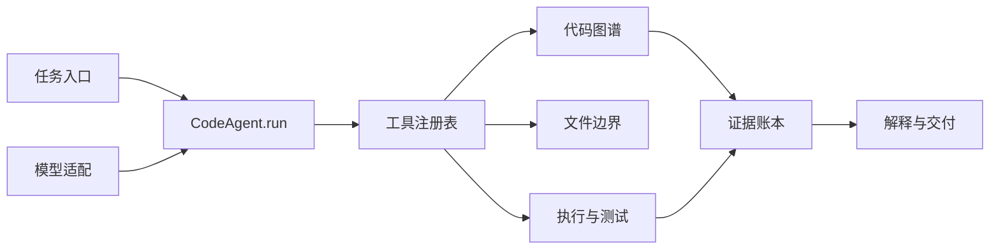

# CodeAgent 设计说明

## 目标

Homework 1 要求一个可用的代码助手：接收任务，调用至少一个工具，并把结果返回给用户。本实现用原生 Python 和 OpenAI-compatible API 完成一条短而可测试的 ReAct 循环，同时给每次改动留下可检查的工程证据。

项目的中心问题不是“模型能不能写出代码”，而是“这次改动为什么值得相信”。因此展示页把任务、工具动作、文件/符号、运行结果和交付说明放进同一张证据图谱。

## 架构



`code_agent.py` 只负责循环、工具契约和服务入口；`code_graph.py` 负责解析与查询；`languages.py` 保存语言规则。展示页是独立的静态界面，不把源码上传到浏览器或第三方服务。

## 一次任务的闭环

1. `build_graph` 建立或刷新本地关系图，避免把整个仓库塞进上下文。
2. 模型根据任务和图谱邻域选择一个工具，参数受 JSON Schema 约束。
3. 工具在仓库边界内读、写或执行代码。
4. `run_python` 把退出码、标准输出和错误输出作为观察回传。
5. 成功时返回简短结论；失败时把观察放进下一轮，直到修复成功或触发步数上限。
6. 每个回合可归档为一条账本事件：`stage`、`tool`、`path`、`elapsed_ms`、`exit_code`、`defect`。

循环的停止条件是模型返回普通文本、达到 `max_steps`，或执行器超过 30 秒。异常会被转成工具观察，避免一次失败直接丢失上下文。

## 工具边界

| 工具 | 输入 | 约束 |
| --- | --- | --- |
| `build_graph` | 仓库根目录 | 忽略 `.git`、虚拟环境、构建产物和敏感文件 |
| `query_graph` | 查询词、数量上限 | 最多返回 30 个匹配和 120 条关系 |
| `read_file` | 相对路径、起止行 | 单次最多 200 行、路径必须在仓库内 |
| `write_file` | 相对路径、完整文本 | 禁止越界和写入凭证文件 |
| `run_python` | 文件名或短代码 | 独立子进程，30 秒超时，截断输出 |

模型只能调用注册表中的工具。仓库内容被视为数据，不会被当作额外系统指令。API key 只从环境变量或本地配置读取，不写入图谱。

## 设计机会：变更到证据

这是一个面向本作业的可检验假设，不宣称覆盖所有开源项目：现有代码助手常展示对话或工具调用，却没有把“哪个文件因哪次决策发生变化、哪条测试证明它有效”连成一条时间线。轻量证据账本用很少的状态记录补上这段缺口：

```text
用户任务
  └─> Agent 决策
       └─> 工具调用
            └─> 文件 / 符号改动
                 └─> 运行结果 / 缺陷
                      └─> 交付说明与下一次基线
```

展示页的 H1 视图呈现单 Agent 的真实工具边界，H2 视图沿用同一份代码关系，把证据路径作为第二个阅读入口。两种视图不复制一套假数据，模块、来源和连线仍指向当前 checkout。

## 展示页动效

视觉参考采用固定桌面分栏：左侧是低亮网格和架构卡片，右侧是可滚动检查栏。连线按语义使用蓝、青、紫、黄、珊瑚和绿色，进入页面时逐条绘制；悬停节点会压暗无关链路，点击模块进入内部视图，按 `Esc` 返回。底部证据卡片与模块之间用流动虚线连接，让“横切关注点”有实际的空间关系。

卡片层次、语义颜色、低强度阴影和连线高亮全部由 CSS/SVG 生成；不依赖远程图片或字体，离线打开仍保留层次和交互。减少动效时只保留必要的状态切换。

## 课程要求对应关系

| 要求 | 实现 |
| --- | --- |
| 输入 → 推理 → 工具 → 输出 | `CodeAgent.run()` 的消息循环 |
| 至少一种工具 | 五个本地工具，包含读取、写入、执行和关系查询 |
| 记忆与上下文 | 消息列表 + 代码图谱邻域查询 |
| 错误处理与重试 | 工具错误作为观察回流，步数和超时双重停止 |
| 可维护性 | 语言规则、图谱、Agent、展示页分层 |
| 文档 | `README.md`、本文件和可操作的展示页 |

## 验证记录

```powershell
python -m py_compile code_agent.py code_graph.py languages.py
python code_agent.py . --graph
```

图谱构建应返回 0 个解析错误；页面应能从 `/` 重定向到 `/agent`，H1/H2 可切换，模块可下钻，`Esc` 可返回全景。没有模型 key 时只运行本地构图即可完成界面验收。

## 已知边界

- 静态图无法解析所有动态调用，未知关系会被省略并在统计中保留覆盖信息。
- 执行器是本地子进程隔离，不等同于操作系统级沙箱；提交真实仓库前仍应使用专用隔离环境。
- 账本视图目前以展示和接口约定为主，后续可把 `CodeAgent` 的事件列表接到 `/api/events`，直接显示一次真实任务的时间线。
