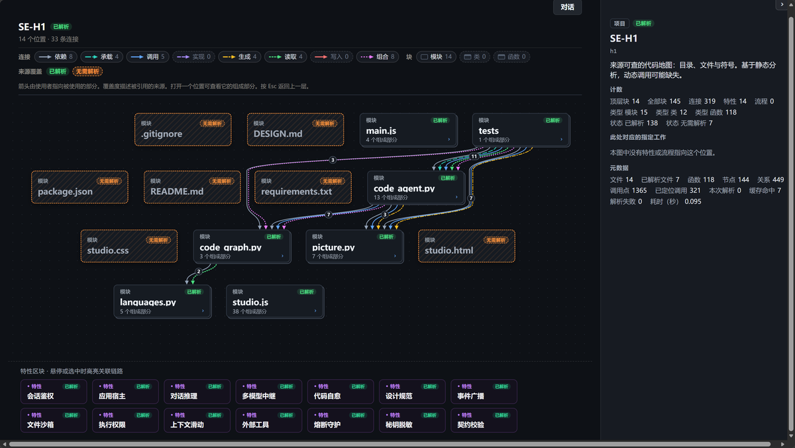
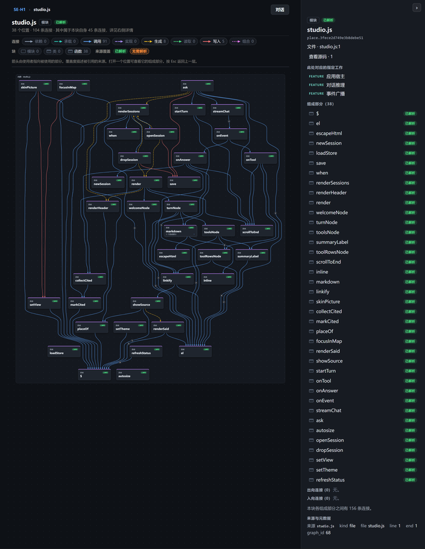
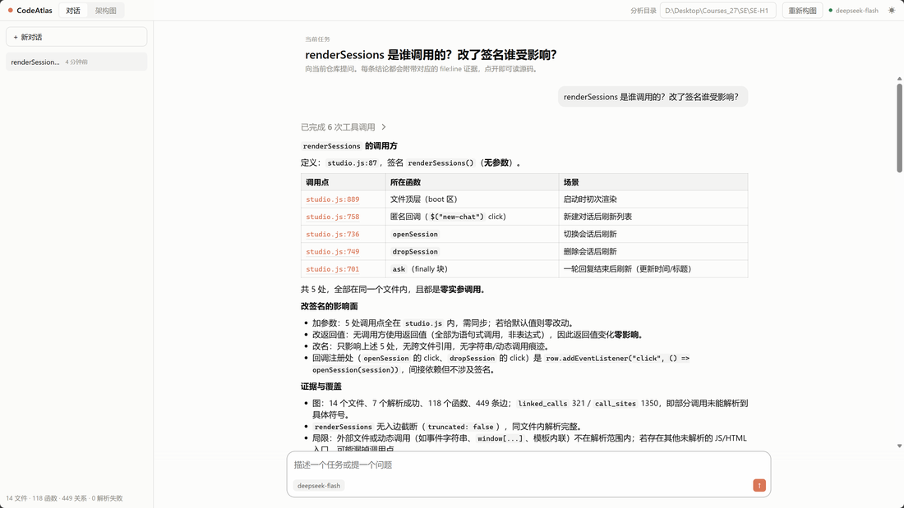
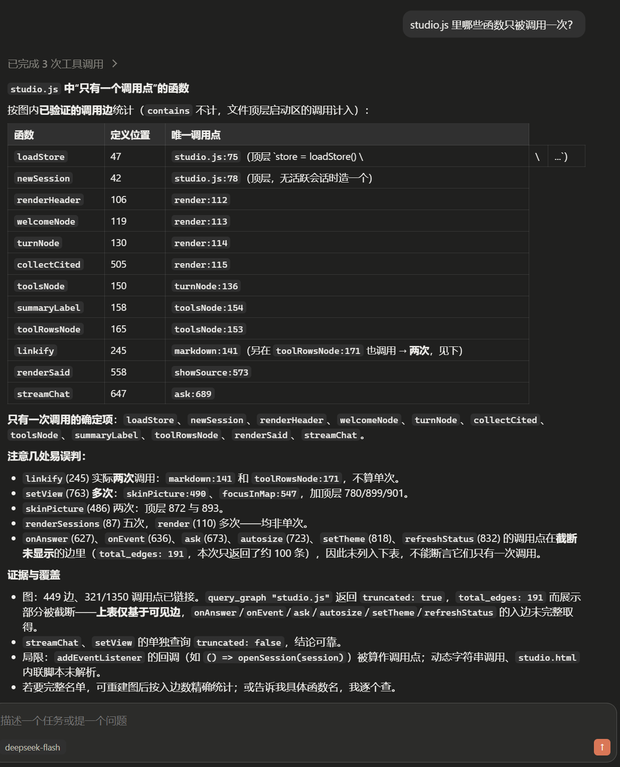

# CodeAtlas Studio

一个面向代码库审查的单 Agent 工作台。它接收提问，按需调用工具，把当前 checkout 的真实文件、符号和调用关系整理成可下钻的架构图，再用这些证据返回结论。

两个视图共享一个外壳：

| 视图 | 内容 |
| --- | --- |
| **对话** | 多轮追问，工具调用逐步上屏，每条结论挂 `file:line` 证据 |
| **架构图** | 逐层下钻的 block map：只画当前层，层外的边收束成 ghost 块 |

两者不是并排的两个功能，而是同一个问题的两面：对话回答「为什么这么说」，架构图回答「代码在哪」。agent 引用过的文件在图上会被标为「结论涉及」，点对话里的证据可以直接跳到图上那个位置，点图上的块可以读源码、也能看到本次对话中对它说过什么。

界面全中文。主题可切换（深色优先），架构图跟随开关。服务只读取本地代码，不上传源码。

## 展示



仓库根层：14 个位置、33 条连接。虚线块是「无需解析」的非代码文件，不是解析失败。



点进 `studio.js`：38 个函数和它们之间的调用关系，指向层外的边收束成「层外」ghost 块。



问「`renderSessions` 是谁调用的」：结论文末列出 5 个调用点各自的 `file:line` 和场景。



追问「哪些函数只被调用一次」：agent 自己报出 `truncated: true`，说明这张表只覆盖可见边。

## 运行

```powershell
python -m venv .venv
.\.venv\Scripts\Activate.ps1
pip install -r requirements.txt
python code_agent.py . --port 8768
```

浏览器会打开 `http://127.0.0.1:8768/`。

没有模型 key 时**同样可以完整使用**：界面右上角会标成「离线 · 本地静态审查」，对话走本地图结构审查，结论依然带可点开的源码位置。配置 key 后走真实的多步工具循环：

```powershell
$env:DEEPSEEK_API_KEY = "your-key"
$env:DEEPSEEK_MODEL   = "deepseek-flash"   # 可选，默认就是这个；也可用 deepseek-v4-pro
python code_agent.py . --port 8768
```

走 DeepSeek 官方接口（`https://api.deepseek.com`，OpenAI 兼容），所以只用 `openai` SDK，没换客户端。模型默认 `deepseek-flash`（1M 上下文，支持 tool calls），`deepseek-v4-pro` 更强但贵约 3 倍。设 `DEEPSEEK_BASE_URL` 可指向别的兼容端点。

只构建图谱、不起服务：

```powershell
python code_agent.py . --graph
```

## 界面

**对话视图** —— 左侧是会话列表（存在浏览器本地，刷新后还在），中间是消息流。提问后可以先看着工具调用一行行出现，再读结论；结论和工具详情里出现的 `文件.py:120` 都是可点开的，弹窗里显示该位置的真实源码片段。

**架构图** —— 一次只显示当前这一层的块和它们之间的关系；指向层外的边收束到标记为「层外」的 ghost 块上，所以不会出现穿堂而过的长线。点块下钻，`Esc` 返回上一层，`/` 聚焦搜索。右侧详情面板给出计数、来源、组成部分和出入向连接。整层缩放到窗格内，根层一屏放得下。

**两个视图怎么连** —— 对话里出现过的每个 `file:line` 都是可点开的：弹窗给出该位置的真实源码，另外列出本次对话中说到这个地方的原文。点「在架构图中查看」，图会切过去并跳到那个位置；反过来，图上被对话引用过的块带蓝色描边和「结论涉及」标记，点它的「查看源码」打开同一个弹窗。所以从一条结论可以走到它依赖的代码，从一块代码可以走回关于它的结论。

**侧栏** —— 只在对话视图显示；看架构图时它收起，地图摊满整个宽度。标题栏的「分析目录」改路径后 `重新构图`，地图就地刷新，不需要重启服务。本地目录和浅克隆地址都支持。

## 本地接口

| 方法 | 路径 | 作用 |
| --- | --- | --- |
| `POST` | `/api/chat` | 按 `{ "session": "…", "prompt": "…" }` 运行一次对话，返回 NDJSON 事件流 |
| `GET` | `/api/status` | 当前模式（`llm` / `local`）、模型名、仓库路径、图谱统计 |
| `GET` | `/api/graph` | 服务当前分析仓库的完整图谱 |
| `GET` | `/api/picture` | 架构图的 `architecture-map-model/2` 片段，供重新构图后就地刷新 |
| `GET` | `/api/source?file=code_agent.py&line=120` | 图谱中已知源码的最多 120 行片段 |
| `POST` | `/api/build` | 按 `{ "repo": "…" }` 重新分析本地目录或浅克隆地址 |

`/api/chat` 的事件流是一行一个 JSON：

```
{"t":"session","session":"…"}
{"t":"tool","id":"call_1","phase":"Agent step 1","tool":"query_graph","state":"running","detail":"…"}
{"t":"tool","id":"call_1","phase":"Agent step 1","tool":"query_graph","state":"done","detail":"…"}
{"t":"answer","text":"…"}
{"t":"done","mode":"llm","steps":3,"tokens":412}
```

静态资源走白名单，未匹配的路径一律 404 —— 不从工作目录读文件，所以 `.env`、`auth.json`、私钥不会被顺手发布出去。`/api/source` 只接受当前图谱中的文件名，路径必须留在仓库内；越界、外部符号链接和上述敏感文件都拒绝读取。

## 工具

| 工具 | 作用 |
| --- | --- |
| `build_graph` | 用 Tree-sitter 建立真实文件、符号和关系图 |
| `query_graph` | 查询符号及其入边、出边，限制上下文规模并报告截断 |
| `read_file` | 按行读取仓库内文件，单次最多 200 行 |
| `write_file` | 在仓库边界内写入修改 |
| `run_python` | 在超时受限的子进程中执行 Python 并保留输出 |

工具错误会回流到下一轮，步数和执行时限共同限制循环。API key 只从环境变量或本地配置读取，不写进图谱，也不回显给前端。

## 这个系统好在哪

1. **结论可追溯** —— 每条判断都能点开对应 `file:line` 的真实源码，不是黑箱输出。离线模式同样如此，结论直接引用关系最密集的符号位置、解析不完整的文件和测试文件。
2. **无 key 也能跑** —— 没有模型凭证时自动降级为本地图结构审查，界面明确标注当前模式，不会假装调用了模型。两条路径产出同一种事件流。
3. **过程可见** —— 工具调用按 `running` → `done` 逐步上屏，能看到 agent 查了什么、查了几次、哪一步失败。
4. **多轮追问** —— 配置模型时服务端按会话保留消息上下文；会话记录存在浏览器本地，刷新后继续。没有 key 时每个问题各自从图结构独立作答，但会话仍然完整保留。
5. **结论与结构互相可达** —— 对话里引用的位置在图上被标出来，图上的块能反查对话对它说过什么。一步之内在「为什么这么说」和「代码在哪」之间来回，不用自己在两处之间找。
6. **任意仓库** —— 本地路径或浅克隆地址都能构图，界面内可重新构图，不需要重启服务。
7. **不静默丢** —— 解析失败的文件数、无法静态定位的调用点数都进统计并在界面上显示，覆盖率的缺口是可见的。

## 代码结构

| 文件 | 来源 | 作用 |
| --- | --- | --- |
| `code_agent.py` | 本项目 | 模型循环、工具契约、会话表、HTTP 服务、NDJSON 事件流、边界检查 |
| `code_graph.py` | 本项目 | 增量解析、调用关系解析、缓存 |
| `languages.py` | 本项目 | 各语言的 Tree-sitter 提取规则 |
| `picture.py` | 本项目 | 把 CodeGraph 投影成 `architecture-map-model/2` |
| `studio.html` / `studio.css` / `studio.js` | 本项目 | 工作台外壳：标题栏、会话列表、对话渲染、composer、主题、视图切换，以及两个视图之间的跳转 |
| `vendor/limen/` | **第三方** | 架构图 viewer（见下） |
| `notebook/homework1_agent.ipynb` | 本项目 | 手工练习：从一次裸 Chat Completions 出发，逐步加上 `read_file` / `write_file` / `run_python`、图谱工具和 compact，用来把 agent 的机制拆开看 |

### 关于 `vendor/limen/`

架构图 viewer 来自 [`overment/limen`](https://github.com/overment/limen) 的 `picture/viewer/` @ `62c8c0b`（MIT License，© Adam Gospodarczyk，许可证见 `vendor/limen/LICENSE`）；我只做了 shadow root 嵌入、窗格适配和中文文案三处适配，改动记在两个文件开头的注释里，地图本身的布局和下钻一行没动。`picture.py` 负责把 CodeGraph 转成它要的 `architecture-map-model/2` 模型。

## 验证

```powershell
python -m pytest tests -q
python -m py_compile code_agent.py code_graph.py languages.py picture.py
python code_agent.py . --port 8768
```

测试不需要模型 key，也不需要网络。覆盖：工具事件回调与假模型客户端、NDJSON 对话流、会话复用与淘汰、离线审查的证据引用、源码读取的行数限制与仓库边界、静态资源白名单、圆形图数据内联且无远程依赖、vendored viewer 不再依赖整文档选择器、许可证随代码存在。

手工走一遍：打开 `/` → 提问，工具行逐步出现 → 点开结论里的 `file:line`，弹窗给出源码和对话原文 → 点「在架构图中查看」，图切过去并跳到该位置，块上有「结论涉及」标记 → 点块下钻出现层外 ghost 块，`Esc` 返回 → 切回对话，状态还在 → 切浅色主题，外壳和地图一起变浅 → 改「分析目录」后重新构图，地图就地刷新。

## 边界

静态解析无法覆盖所有动态调用，未能唯一解析的关系会被省略并计入统计；图谱是静态近似，不是运行时事实。`run_python` 是超时受限的本地子进程，不等同于操作系统级沙箱；处理不可信仓库时仍应使用专用隔离环境。离线审查不做语义理解，只从图结构推导结论。

架构图只按宽度适配、没有缩放下限，所以块多的深层级（例如 `studio.js` 那层的 38 个块）会整体等比缩小，字跟着一起变小。这是当前版本的一处已知取舍：加回下限就得让深层级横向滚动。点块下钻会写 URL hash，所以浏览器后退键是返回上一层，不是离开页面。
